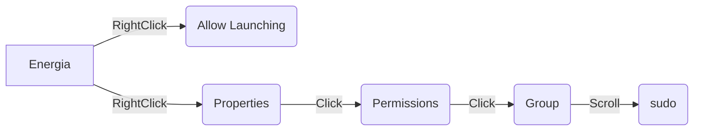

# ROS on RSLK Guide
### This guide will go over the setup process for installing [rosserial](http://wiki.ros.org/rosserial) on the [TI RSLK](https://university.ti.com/en/faculty/ti-robotics-system-learning-kit/ti-robotics-system-learning-kit#:~:text=The%20TI%20Robotics%20Systems%20Learning,Developed%20in%20collaboration%20with%20Dr.) and control it using [ROS](http://wiki.ros.org/Documentation)


:heavy_exclamation_mark: This guide will be using Ubuntu 20.04 with all instruction as if fresh install 

:heavy_exclamation_mark: If you alter file/directory locations some steps may need to be altered


### This walk-through will give step by step instruction on the following:
**Required**
 - [ ] Install Arduino 
 - [ ] Install Code Composer 
 - [ ] Install ROS
 - [ ] Install ROS Serial
 - [ ] Edit files to allow ROS Serial to interact with MSP432
 - [ ] Run Example Code

**Optional** 

 - [ ] Install VirtualBox and create a virtualized Linux system
 - [ ] Install Energia 
 - [ ] Install Visual Studio Code 

### Useful Linux Command Line Commands

| Linux Command | Operation  |
|--|--|
| pwd | Show current directory |
|mkdir *dir* |Make directory _dir_|
| cd *dir* | Change directory to _dir_ |
| cd .. |   Go up a directory |
| ls | List files |
|cd ~/ | Change to Home directory
[Expanded Command Line Cheat Sheet](https://cheatography.com/davechild/cheat-sheets/linux-command-line/)

### Useful Linux Keybinds
| Keybind | Shortcut  |
|--|--|
|shift + ctrl + v |   Paste |
| tab | Auto complete |


Install git.....maybe need
```
sudo apt install git
```


# 1. Install Code composer
Source Page: [Code Composer](https://www.ti.com/tool/CCSTUDIO?utm_source=google&utm_medium=cpc&utm_campaign=epd-der-null-58700007779115352_code_composer_rsa-cpc-evm-google-wwe&utm_content=code_composer&ds_k=code+composer&gclid=CjwKCAjw3K2XBhAzEiwAmmgrAvcbfPHsoayrKN0Y8kCgjbqTkyleYJD60xYukmRZfhQrXIRSlARGnBoCmfUQAvD_BwE&gclsrc=aw.ds)

Code composer is required for its emulation properties. Without these linker files Arduino will not be able to compile for the MSP432P401R board. We are using Ubuntu 20.04 LTS, which requires version 10 of code composer studio (CCS V10).
#### 1.1 Install Dependencies
First update the system
```
sudo apt update
```
Upgrade the system
```
sudo apt upgrade
```

Then install dependent libraries (required before installing CCS V10)
```
sudo apt install libc6:i386 libusb-0.1-4 libgconf-2-4 libncurses5 libpython2.7 libtinfo5
```
#### 1.2 Install Code Composer
   :heavy_exclamation_mark: When downloading WAIT for the download to complete before proceeding to the next step
[CCS 10.4.0 Download](https://software-dl.ti.com/ccs/esd/CCSv10/CCS_10_4_0/exports/CCS10.4.0.00006_linux-x64.tar.gz)

Open a new terminal and paste the commands:
```
cp ~/Downloads/CCS10.4.0.00006_linux-x64.tar.gz ~/Documents 
```


Navigate to and extract the file
```
cd ~/Documents/
tar  -xvf  CCS10.4.0.00006_linux-x64.tar.gz
```
run the installer
```
cd ~/Documents/CCS10.4.0.00006_linux-x64/
./ccs_setup_10.4.0.00006.run
```
follow gui installer accept all default options 
Select Setup type: Custom Instillation(Recommended) 
then msp(insert pic)
Finish
Now open CCS


Move CCS from downloads to documents
extact
go in 1 file
double click and install ->custom->msp432

launch CCS
launch ccs1


help->check for updates
next->next->accept terms->finish->restart


Once Code Composer is installed you will need to do a bunch of updates


# 1. Installing Arduino on Linux 
#### 1.1 Install Arduino
One line command to install arduino 
```
sudo snap install arduino
```
#### 1.2 Add MSP432P401R Board to Arduino
The MSP432 is not a standard board in the Arduino library so in order to use this board we will need to manually add it to our board list. 
#### 1.2.1 Download Board JSON
Copy the follwing link: http://s3.amazonaws.com/energiaUS/packages/package_energia_index.json
#### 1.2.1 Add Board to list of Arduino compatable boards
Open Arduino and navigate to: 
>File->Preferences->Additional Boards Manager URLs: 

Paste the link (If there is already a board in the URL space add comma and then paste new board link) and then click *OK*

#### 1.2.1 Install the MSP432P401R Board
>Tools->Board->Boards Manager... 

Search *"msp"* and install "*ENERGIA MSP432 EMT RED boards*" 

 InsertPIC
#### 1.2.2 Select the MSP432P401R Board
Now select the board
>Tools->Board-> EnergiaMSP432 ->Red LaunchPad


#### 1.2.2 Test MSP432P401R Board in Arduino
To ensure that installation is correct, in Arduino navigate 
>File->Examples->01.Basics->Blink

For the MSP we need to change LED_BUILTIN to RED_LED


Select the port
insert pic portSelect

Now save the file and upload the sketch
:star: **If the red LED is blinking you have sucessfully installed the board into Arduino**

### 1.3 Install RSLK Library
SimpleRSLK is a library that contains functions to allow us to easily interact with the RSLK peripherals 

#### 1.3.1 Download the RSLK Library: [SimpleRSLK](https://hacksterio.s3.amazonaws.com/uploads/attachments/1217431/RSLK-Robot-Library.zip)

#### 1.3.2 Install the RSLK Library
In Arduino navigate:
>Sketch->Include Library->Add .Zip Library->double click downlods on left and select RSLK-Robot-Library.zip->ok
#### 1.3.3 Verify RSLK Library Install
In Arduino navigate:
>File->Examples->TI-Robot-Lib->_Dancing_Robot_Simplified->upload

:star: **If your RSLK wheels are spinning you have sucessfully installed the SimpleRSLK library**


# 2. Installing ROS
Source Page: [ROS Wiki](http://wiki.ros.org/noetic/Installation/Ubuntu)

#### 2.1 Setup your sources.list
Setup your computer to accept software from packages.ros.org.
```
sudo sh -c 'echo "deb http://packages.ros.org/ros/ubuntu $(lsb_release -sc) main" > /etc/apt/sources.list.d/ros-latest.list'
```
#### 2.2 Setup your keys
```
sudo apt install curl
```
```
curl -s https://raw.githubusercontent.com/ros/rosdistro/master/ros.asc | sudo apt-key add -
```
#### 2.3 Make sure your package is up to date
```
sudo apt update
sudo apt upgrade
```
#### 2.4 ROS Desktop-Full Install
>:hourglass_flowing_sand: **This will take a while**
```
sudo apt install ros-noetic-desktop-full
```
#### 2.5 Enviroment Setup
```
echo "source /opt/ros/noetic/setup.bash" >> ~/.bashrc
source ~/.bashrc
```
#### 2.6 Inspect ROS Enviroment 
:star: **ROS should now be installed**. Following command verifies installation
```
printenv | grep ROS
```
#### 2.7 Create a ROS Workspace
```
mkdir -p ~/catkin_ws/src
cd ~/catkin_ws/
catkin_make
```

#### 2.8 Enviroment Source Upadate
```
echo "source ~/catkin_ws/devel/setup.bash" >> ~/.bashrc
source ~/.bashrc
```
To make sure your workspace is properly overlayed by the setup script, make sure ROS_PACKAGE_PATH environment variable includes the directory you're in.
Ex: 
>/home/"***name***"/catkin_ws/src:/opt/ros/kinetic/share
```
echo $ROS_PACKAGE_PATH
```


# 3. Installing rosserial for Arduino
Source Page: [rosserial_arduino wiki](http://wiki.ros.org/rosserial_arduino)
#### 3.1  Installing on the ROS workstation
You can install rosserial for Arduino by running:
```
sudo apt-get install ros-noetic-rosserial-arduino
sudo apt-get install ros-noetic-rosserial
```
#### 3.2 Install ros_lib into the Arduino Environment
The preceding installation steps created the necessary libraries, now the following will create the ros_lib folder that the Arduino build environment needs to enable Arduino programs to interact with ROS.

Navigate to your Energia sketches directory and prepare the libraries.
```
cd ~/Documents/energia-1.8.10E23/libraries/
rm -rf ros_lib
rosrun rosserial_arduino make_libraries.py .
```
#### 3.3  Verify ROS Serial instillation 
Open Arduino and navigate:
>Files->Examples->ros_lib

:star: **If you see example files under ros_lib you have correctly installed ROS Serial**


# 5. Edit rosserial Files for TI RSLK
Since we are using a non-standard board for rosserial there are a few alterations that need to be made to base files before we can upload our first ROS script. (Any text editor will work)
### 5.1 Change Buffer Size for hardware
Navigate
>Documents->arduino->arduino->libraries->ros_lib->ros->node_handle.h

Change default node template to the following:


Save and close file

### 5.2 Change Baud Rate
Navigate 
>Documents->arduino->arduino->libraries->ros_lib->ArduinoHardware.h
>
Change baud on lines 67 and 81 from 57600 to 115200


### 5.3 Add Delay at Startup
In the same ArduinoHardware.h file
 add the following to line 103

    delay(3000);


Save and close file

### 5.4 Change RSLK header file 
Navigate
>Arduino->libraries->Robot-Library->src->SimpleRSLK.h

add the following above the #endif

    void setRawMotorSpeed(uint8_t motorNum, uint_t speed);

 

# 6. Demo Code

Finally we use ROS Serial on the RSLK
### 6.1 We will use the Blink sketch as an example subscriber
Source Blink Example: [ROS Wiki](http://wiki.ros.org/rosserial_arduino/Tutorials/Blink)
#### 6.1.1 Open the Example Blink Sketch
In Arduino navigate:
>File->Example->ros_lib->Blink
#### 6.1.2 Edit Blink Sketch
Agian we must edit Blink sketch to be compatable with MSP432 LED_BUILTIN to RED_LED

#### 6.1.3 Upload to Board

#### 6.1.4 Using ROS
Now, launch the [roscore](http://wiki.ros.org/roscore) in a new terminal window:
```
roscore
```
Next, run the rosserial client application that forwards your Arduino messages to the rest of ROS.
```
rosrun rosserial_python serial_node.py /dev/ttyACM0 _baud:=115200
```
Finally, you can toggle the LED using [rostopic](http://wiki.ros.org/rostopic):
```
rostopic pub toggle_led std_msgs/Empty --once
```


# 7. Install Simulation Models
Install Dependencies
	
    sudo apt-get install ros-noetic-xacro
    sudo apt-get install ros-noetic-gazebo-ros
Download Simulation folder

	cd ~/Documents/
    git clone https://github.com/JS-CTRL/Images.git
    cd ~/Documents/Images/rslk_ws/

Build 

    catkin_make
    
Source it   

    echo "source ~/Documents/Images/rslk_ws/devel/setup.bash" >> ~/.bashrc
    source ~/.bashrc
Launch 

    roslaunch rslk world.launch
Gazebo should open and you should see a simplifies RSLK model in the center of the simulation
Close Gazebo and install odom_test code to the RSLK
Now, launch the [roscore](http://wiki.ros.org/roscore) in a new terminal window:
```
roscore
```
Next, launch the serial_node
```
rosrun rosserial_python serial_node.py /dev/ttyACM0 _baud:=115200
```
Monitor the positional data
```
rostopic echo /tf
```
if X and Y are changing launch rviz
```
rviz
```
Change Fixed Frame from map to odom
Add TF
should see chassis driving in a circle around stationary odom origin
add RobotModel
should see robot model imposed over chassis 
# Optional (Nice to Haves)
# 8. Install Visual Studio Code
Not required but makes file navigation easier 

### 8.1 Download VSC
Download Virtual Studio Code here: [Download](https://go.microsoft.com/fwlink/?LinkID=760868)
### 8.1 Install VSC
Go to Downloads folder 

double click/run the installer 


# 9. Custom Application Launcher
Source tutorial here: [Source](https://linuxconfig.org/how-to-create-desktop-shortcut-launcher-on-ubuntu-22-04-jammy-jellyfish-linux)
#### 8.1 Create File
Create the file on desktop to use as shortcut template

Need to install text editor. This example will use VIM (Nano also works)

Install vim
```
sudo apt install vim
```
Create and open blank document on desktop
```
vim ~/Desktop/Energia.desktop
```
press 'i' to insert
copy and paste into doc
```
#!/usr/bin/env xdg-open
[Desktop Entry]
Version=1.0
Type=Application
Terminal=false
Exec= /home/test/Documents/energia-1.8.10E23/energia
Name=Energia
Comment=Energia
Icon= /home/test/Documents/energia-1.8.10E23/lib/arduino.png
```
Then close and save with the following
>ESC :wq ENTER

Allow launching enables file as application launcher/shortcut
Set permission to Sudo to enable USB access





# 10. Installing Energia on Linux

Source Page: [Energia](https://energia.nu/guide/install/linux/)
#### 10.1 Download Energia Linux 64-bit: [Download](https://energia.nu/downloads/downloadv4.php?file=energia-1.8.10E23-linux64.tar.xz)
Download and Save File
#### 10.2 Extract
Open a terminal
> :bulb: **Terminal Shortcut:** Press *ctrl + alt + t*

Now we copy the compressed download to ***/Documents*** 
```
cp ~/Downloads/energia-1.8.10E23-linux64.tar.xz ~/Documents 
```


Navigate to and extract the file
```
cd ~/Documents/
tar  -xvf  energia-1.8.10E23-linux64.tar.xz
```
> :heavy_exclamation_mark: **If energia package has been updated/different name use:**  
```
tar  -xvf  <tar_archive>
```
#### 10.3 Install IDE
Install python2.7 
```
sudo apt-get install python2.7-dev
```

Move to working directory, install arduino base and energia
```
cd ~/Documents/energia-1.8.10E23/
sudo bash install.sh
```
Set up Arduino
```
./arduino-linux-setup.sh $USER
```
Reboot the system
```
systemctl reboot -i
```
After reboot navigate back to dierectory and open energia in administrator mode
```
cd ~/Documents/energia-1.8.10E23/
sudo ./energia
```
:star: Energia should now be open with a blank sketch
#### 10.4 Configure Energia for our board MSP432P401R
In energia IDE

##### 10.4.1 Install board 
>Tools->Board->Board Manager->type '432p' in search bar and install Energia MSP432 EMT RED  boards(takes a while) &rarr; Close Energia


Open energia
```
sudo ./energia
```


>Tools->board->select RED LaunchPad w/msp432p401rEMT(48MHz)
Tools->Port->/dev/ttyACM1
Tools->Programmer->"dslite"
File->Example->01.Basics->Blink->upload

:star: **If your board is blinking, Energia is correctly installed**

# 11. Installing VirtualBox 
>### These directions are for a Windows install 
> :heavy_exclamation_mark: **Skip this step if you have a working version of Ubuntu 20.04**  
> Source Page: [VirtualBox Source](https://www.virtualbox.org/wiki/Downloads) 

#### 11.1 Download VirtualBox here: [VirtualBox](https://download.virtualbox.org/virtualbox/6.0.24/VirtualBox-6.0.24-139119-Win.exe)
Virtual Box is the emulation software that we will be virtualizing our Ubuntu enviroment in 
#### 11.2 Download VirtualBox extension here: [VB Extension](https://download.virtualbox.org/virtualbox/6.0.24/Oracle_VM_VirtualBox_Extension_Pack-6.0.24.vbox-extpack)
The extension allows the user to connect a USB device to the virtual enviroment 

#### 11.3 Download Ubuntu 20.04 OS here: [Ubuntu](https://ubuntu.com/download/desktop/thank-you?version=22.04&architecture=amd64)
We need to load an operating system onto our linux system
#### 11.4 Create a Virtual Enviroment
New 

Name whatever

Type linux

version ubuntu 64

next

select memory Depends on system (1/2)

next

Create a virtual hard disk now

VDI (VirtualBox Disk Image)

Next

Dynamically Allocated

next

50GB

create

right click

setting 

usb

add 

one that says TI

made share bidirectional 

Start!

scroll to ubuntu-20.04-desktop-amd64.iso ( select from wherever you previously download it)

start

setup usb
>Virtual Machine tool bar->Devices->Insert Guest->Run 
>press enter in instillation terminal
>reboot
```
systemctl reboot -i
```

Enable USB to virtual machine
plug in board

>Open virtual box application->right click enviroment->settings->USB->add->Texas Instuments XDS110->ok

Connect usb in Virtual Machine
>Virtual Machine tool bar->Devices->USB->TI one
>
# 12. Installing rosserial for tivaC
Source Page: [rosserial wiki](http://wiki.ros.org/rosserial_tivac/Tutorials/Energia%20Setup)
#### 12.1  Download and build rosserial_tivac
First we need to install git in order to download the ROSSerial repository as well as set python 3 as alias "python"
```
sudo apt install git
sudo apt install python-is-python3
```

Navigate to your ROS workspace. Clone the git repository. Then build and install the package.
```
cd ~/catkin_ws/src
git clone https://github.com/ros-drivers/rosserial.git
cd ~/catkin_ws/
catkin_make
catkin_make install
```
#### 12.2  Prepare ROS Serial libraries for Energia
Now you have to prepare the libraries required for Energia to compile sketches with ROS enabled communication.
Add the installed rosserial_tivac to path. Or add the command to .bashrc.
```
echo "source ~/catkin_ws/install/setup.bash" >> ~/.bashrc
source ~/.bashrc
```
Navigate to your Energia sketches directory and prepare the libraries.
```
cd ~/Documents/energia-1.8.10E23/libraries/
rosrun rosserial_tivac make_libraries_energia .
```
#### 12.3  Verify ROS Serial instillation 
Open Arduino and navigate:
>Files->Examples->ros_lib

:star: **If you see example files under ros_lib you have correctly installed rosserial**
