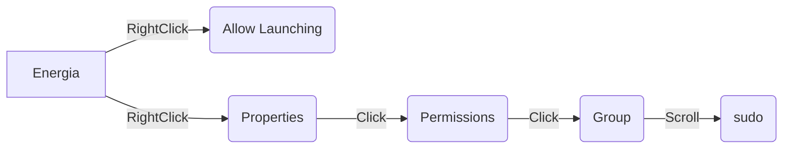

# 1. Installing Virtualbox
Source Page: [virtualbox Source](https://www.virtualbox.org/wiki/Downloads) 
#### 1.1 Download virtualbox here: [virtualbox](https://download.virtualbox.org/virtualbox/6.0.24/VirtualBox-6.0.24-139119-Win.exe)
#### 1.2 Download virtualbox extension here: [extension](https://download.virtualbox.org/virtualbox/6.0.24/Oracle_VM_VirtualBox_Extension_Pack-6.0.24.vbox-extpack)
#### 1.3 Create a Virtual Enviroment
New 
Name whatever
Type linux
version ubuntu 64
next
select memory Depends on system (1/2)
next
Create a virtual hard disk now
VDI (VirtualBox Disk Image)
Next
Dynamically Allocated
next
20GB
create
right click
setting 
usb
add 
one that says TI
made share bidirectional 
Start!
scroll to ubuntu-20.04.03-desktop-amd64.iso
start


# 2. Installing Energia on Linux
### Usefull Linux Command Line Commands

| Linux Command | Operation  |
|--|--|
| pwd | Show current directory |
|mkdir *dir* |Make directory _dir_|
| cd *dir* | Change directory to _dir_ |
| cd .. |   Go up a directory |
| ls | List files |
[Expanded Command Line Cheat Sheet](https://cheatography.com/davechild/cheat-sheets/linux-command-line/)

tab for autocomplete

Source Page: [Energia](https://energia.nu/guide/install/linux/)
#### 2.1 Download Energia Lnux 64-bit: [Download](https://energia.nu/downloads/downloadv4.php?file=energia-1.8.10E23-linux64.tar.xz)
Download and Save File
#### 2.2 Extract
Open a terminal
> :bulb: **Terminal Shortcut:** Press *ctrl + alt + t*

Now we copy the compressed download to ***/Documents*** 
```
cp ~/Downloads/energia-1.8.10E23-linux64.tar.xz ~/Documents 
```


Navigate to and extract the file
```
cd ~/Documents/
tar  -xvf  energia-1.8.10E23-linux64.tar.xz
```
> :heavy_exclamation_mark: **If energia package has been updated/different name use:**  
```
tar  -xvf  <tar_archive>
```
#### 2.3 Install IDE
Install python2.7 
```
sudo apt-get install python2.7-dev
```

Move to working directory, install arduino base and energia
```
cd ~/Documents/energia-1.8.10E23/
sudo bash install.sh
```
Set up Arduino
```
./arduino-linux-setup.sh $USER
```
Reboot the system
```
systemctl reboot -i
```
After reboot navigate back to dierectory and open energia in administrator mode
```
cd ~/Documents/energia-1.8.10E23/
sudo ./energia
```
:star: Energia should now be open with a blank sketch
#### 2.4 Configure Energia for our board mspblkjsdf
In energia IDE

##### 2.4.1 Install board 
>Tools->Board->Board Manager->type '432p' in search bar and install Energia MSP432 EMT RED  boards(takes a while) &rarr; Close Energia

setup usb
>Virtual Machine tool bar->Devices->Insert Guest->Run 
>press enter in instillation terminal
>reboot
```
systemctl reboot -i
```

Enable USB to virtual machine
plug in board

>Open virtual box application->right click enviroment->settings->USB->add->Texas Instuments XDS110->ok

Connect usb in Virtual Machine
>Virtual Machine tool bar->Devices->USB->TI one

Open energia
```
sudo ./energia
```


Tools->board->select RED LaunchPad w/msp432p401rEMT(48MHz)
Tools->Port->/dev/ttyACM1
Tools->Programmer->"dslite"
File->Example->01.Basics->Blink->upload
:star: **Your board should now be blinking**

# 3. Installing ROS
Source Page: [ros wiki](http://wiki.ros.org/noetic/Installation/Ubuntu)

#### 3.1 Setup your sources.list
Setup your computer to accept software from packages.ros.org.
```
sudo sh -c 'echo "deb http://packages.ros.org/ros/ubuntu $(lsb_release -sc) main" > /etc/apt/sources.list.d/ros-latest.list'
```
#### 3.2 Setup your keys
```
sudo apt install curl
```
```
curl -s https://raw.githubusercontent.com/ros/rosdistro/master/ros.asc | sudo apt-key add -
```
#### 3.3 Make sure your package is up to date
```
sudo apt update
sudo apt upgrade
```
#### 3.4 ROS Desktop-Full Install
>:hourglass_flowing_sand: **This will take a while**
```
sudo apt install ros-noetic-desktop-full
```
#### 3.5 Enviroment Setup
```
echo "source /opt/ros/noetic/setup.bash" >> ~/.bashrc
source ~/.bashrc
```
#### 3.6 Inspect ROS Enviroment 
:star: **ROS should now be installed**. Following command verifies installation
```
printenv | grep ROS
```
#### 3.7 Create a ROS Workspace
```
mkdir -p ~/catkin_ws/src
cd ~/catkin_ws/
catkin_make
```

#### 3.8 Enviroment Source Upadate
```
echo "source devel/setup.bash" >> ~/.bashrc
source ~/.bashrc
```
To make sure your workspace is properly overlayed by the setup script, make sure ROS_PACKAGE_PATH environment variable includes the directory you're in.
Ex: 
>/home/"***name***"/catkin_ws/src:/opt/ros/kinetic/share
```
echo $ROS_PACKAGE_PATH
```


# 4. Installing ROSSerial
Source Page: [rosserial wiki](http://wiki.ros.org/rosserial_tivac/Tutorials/Energia%20Setup)
#### 4.1  Download and build rosserial_tivac
Navigate to your ROS workspace. Clone the git repository. Then build and install the package.
```
cd ~/catkin_ws/src
git clone https://github.com/ros-drivers/rosserial.git
cd ~/catkin_ws/
catkin_make
catkin_make install
```
#### 4.2  Prepare rosserial libraries for Energia
Now you have to prepare the libraries required for Energia to compile sketches with ROS enabled communication.
Add the installed rosserial_tivac to path. Or add the command to .bashrc.
```
echo "source ~/catkin_ws/install/setup.bash" >> ~/.bashrc
source ~/.bashrc
```
Navigate to your Energia sketches directory and prepare the libraries.
```
cd ~/Energia/libraries/
rosrun rosserial_tivac make_libraries_energia
```
# 5. Custom Application Launcher
resource: https://linuxconfig.org/how-to-create-desktop-shortcut-launcher-on-ubuntu-22-04-jammy-jellyfish-linux
#### 5.1 Create File
Create the file on desktop

Need to install text editor. This example will use VIM

Install vim
```
sudo apt install vim
```
Create and open blank document on desktop
```
vim ~/Desktop/Energia.desktop
```
press 'i' to insert
copy and paste into doc
```
#!/usr/bin/env xdg-open
[Desktop Entry]
Version=1.0
Type=Application
Terminal=false
Exec= /home/test/Documents/energia-1.8.10E23/energia
Name=Energia
Comment=Energia
Icon= /home/test/Documents/energia-1.8.10E23/lib/arduino.png
```
Then close and save with the following
>ESC :wq ENTER

Allow launching enables file as application launcher/shortcut
Set permission to Sudo to enable USB access


```xml

```


<div style="width: 640px; height: 480px; margin: 10px; position: relative;"><iframe allowfullscreen frameborder="0" style="width:640px; height:480px" src="https://lucid.app/documents/embedded/aa4ef4ba-cb00-46ba-bd06-d4fccdb5b917" id="ZXElKCnOegZY"></iframe></div>

```
[](https://youtu.be/vt5fpE0bzSY)
```
sudo apt install python-is-python3
ensure its right
command python --version
