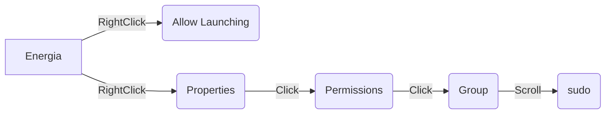

# ROS on RSLK Guide
### This guide will go over the setup process for installing [rosserial](http://wiki.ros.org/rosserial) on the [TI RSLK](https://university.ti.com/en/faculty/ti-robotics-system-learning-kit/ti-robotics-system-learning-kit#:~:text=The%20TI%20Robotics%20Systems%20Learning,Developed%20in%20collaboration%20with%20Dr.) and control it using [ROS](http://wiki.ros.org/Documentation)


**Required Steps**
 - [ ] Install Energia
 - [ ] Install Arduino 
 - [ ] Install ROS
 - [ ] Install rosserial
 - [ ] Edit files to allow ROS Serial to interact with MSP432
 - [ ] Run Example Code

**Optional Steps** 
 - [ ] Install Visual Studio Code 
 - [ ] Create Desktop Short Cut for Arduino

### Useful Linux Command Line Commands

| Linux Command | Operation  |
|--|--|
| pwd | Show current directory |
|mkdir *dir* |Make directory _dir_|
| cd *dir* | Change directory to _dir_ |
| cd .. |   Go up a directory |
| ls | List files |
|cd ~/ | Change to Home directory
[Expanded Command Line Cheat Sheet](https://cheatography.com/davechild/cheat-sheets/linux-command-line/)

### Useful Linux Keybinds
| Keybind | Shortcut  |
|--|--|
|shift + ctrl + v |   Paste |
| tab | Auto complete |


# 1. Setting up Energia

Source Page: [Energia](https://energia.nu/guide/install/linux/)
### 1.1 Download Energia Linux 64-bit: [Download](https://energia.nu/downloads/downloadv4.php?file=energia-1.8.10E23-linux64.tar.xz)
Download and Save File
### 1.2 Extract
Open a terminal
> :bulb: **Terminal Shortcut:** Press *ctrl + alt + t*

Now we copy the compressed download to ***/Documents*** 
```
cp ~/Downloads/<energia_tar_archive> ~/Documents 
```


Navigate to and extract the file
```
cd ~/Documents/
tar  -xvf  <energia_tar_archive>
```

### 1.3 Install IDE
Install python2.7 
```
sudo apt-get install python2.7-dev
```

Move to working directory, install arduino base and energia
```
cd ~/Documents/<energia-x.x.x>/
sudo bash install.sh
```
Set up Arduino
```
./arduino-linux-setup.sh $USER
```
Reboot the system
```
systemctl reboot -i
```
After reboot navigate back to dierectory and open energia in administrator mode
```
cd ~/Documents/<energia-x.x.x>/
sudo ./energia
```
:star: **Energia should now be open with a blank sketch**
### 1.4 Configure Energia for our board MSP432P401R
In energia IDE

#### 1.4.1 Install board 
>Tools->Board->Board Manager->type '432p' in search bar and install Energia MSP432 EMT RED  boards(takes a while) &rarr; Close Energia


Open energia
```
sudo ./energia
```


>Tools->board->select RED LaunchPad w/msp432p401rEMT(48MHz)
Tools->Port->/dev/ttyACM0
Tools->Programmer->"dslite"
File->Example->01.Basics->Blink->upload

:star: **If your board is blinking, Energia is correctly installed**


# 2. Setting up Arduino 
Source Page: [Arduino](https://www.arduino.cc/en/software)

### 2.1 Download Arduino Linux 64-bit: [Download](https://downloads.arduino.cc/arduino-1.8.19-linuxaarch64.tar.xz?_gl=1*1gnlta9*_ga*Nzc3NTM4MTE4LjE2NjAwNjA4NDU.*_ga_NEXN8H46L5*MTY2MTIyMDIwMi4xOC4xLjE2NjEyMjAzNzYuNjAuMC4w)
Download and Save File
### 2.2 Extract

Now we copy the compressed download to ***/Documents*** 
```
cp ~/Downloads/<arduino_tar_archive> ~/Documents 
```


Navigate to and extract the file
```
cd ~/Documents/
tar  -xvf  <arduino_tar_archive>
```


### 2.3 Install Arduino IDE

Move to working directory, install arduino base and energia
```
cd ~/Documents/<arduino-x.x.x-linux64/arduino-x.x.x>/
sudo bash install.sh
```
Set up Arduino
```
./arduino-linux-setup.sh $USER
```
Reboot the system
```
systemctl reboot -i
```
After reboot navigate back to dierectory and open energia in administrator mode
```
cd ~/Documents/<arduino-x.x.x-linux64/arduino-x.x.x>/
sudo ./arduino
```
:star: **Arduino should now be open with a blank sketch**
### 2.4 Configure Arduino for our board MSP432P401R

#### 2.4.1 Add MSP432P401R Board to Arduino
The MSP432 is not a standard board in the Arduino library so in order to use this board we will need to manually add it to our board list. 
#### 2.4.2 Link for location of Board download
Copy the follwing link: http://s3.amazonaws.com/energiaUS/packages/package_energia_index.json
#### 2.4.3 Add Board to list of Arduino compatable boards
Open Arduino and navigate to: 
>File->Preferences->Additional Boards Manager URLs: 

Paste the link (If there is already a board in the URL space add comma and then paste new board link) and then click *OK*

#### 2.4.4 Install the MSP432P401R Board
>Tools->Board->Boards Manager... 


 Search *"msp"* and install "*ENERGIA MSP432 EMT RED boards*"  :hourglass_flowing_sand:

#### 2.4.5 Select the MSP432P401R Board
Now select the board
>Tools->Board-> EnergiaMSP432 ->Red LaunchPad


### 2.5 Test MSP432P401R Board in Arduino
To ensure that installation is correct, in Arduino navigate 
>File->Examples->01.Basics->Blink

For the MSP we need to change LED_BUILTIN to RED_LED


Now save the file and upload the sketch
:star: **If the red LED is blinking you have sucessfully installed the board into Arduino**

### 2.6 Install RSLK Library
SimpleRSLK is a library that contains functions to allow us to easily interact with the RSLK peripherals 

#### 2.6.1 Download the RSLK Library: [SimpleRSLK](https://hacksterio.s3.amazonaws.com/uploads/attachments/1217431/RSLK-Robot-Library.zip)

#### 2.6.2 Install the RSLK Library
In Arduino navigate:
>Sketch->Include Library->Add .Zip Library->double click downlods on left and select RSLK-Robot-Library.zip->ok
#### 2.6.3 Verify RSLK Library Install
In Arduino navigate:
>File->Examples->TI-Robot-Lib->_Dancing_Robot_Simplified->upload

:star: **If your RSLK wheels are spinning you have sucessfully installed the SimpleRSLK library**


# 3. Installing ROS
Source Page: [ROS Wiki](http://wiki.ros.org/noetic/Installation/Ubuntu)


### 3.1 Make sure your package is up to date
```
sudo apt update
sudo apt upgrade
```
### 3.2 Use the [ROS Single-line Instillation](http://wiki.ros.org/ROS/Installation/TwoLineInstall/)
>:hourglass_flowing_sand: **This will take a while**

Use option 1 for Desktop-Full Install
```
wget -c https://raw.githubusercontent.com/qboticslabs/ros_install_noetic/master/ros_install_noetic.sh && chmod +x ./ros_install_noetic.sh && ./ros_install_noetic.sh
```
### 3.3 Enviroment Setup
```
echo "source /opt/ros/noetic/setup.bash" >> ~/.bashrc
source ~/.bashrc
```
### 3.4 Inspect ROS Enviroment 
:star: **ROS should now be installed**. Following command verifies installation
```
printenv | grep ROS
```
### 3.5 Create a ROS Workspace
```
mkdir -p ~/catkin_ws/src
cd ~/catkin_ws/
catkin_make
```

### 3.6 Enviroment Source Upadate
```
echo "source ~/catkin_ws/devel/setup.bash" >> ~/.bashrc
source ~/.bashrc
```
To make sure your workspace is properly overlayed by the setup script, make sure ROS_PACKAGE_PATH environment variable includes the directory you're in.
```
echo $ROS_PACKAGE_PATH
```
:star: **You should see /home/"***name***"/catkin_ws/src:/opt/ros/kinetic/share**


# 4. Installing rosserial for Arduino
Source Page: [rosserial_arduino wiki](http://wiki.ros.org/rosserial_arduino)
### 4.1  Installing on the ROS workstation
You can install rosserial for Arduino by running:
```
sudo apt-get install ros-noetic-rosserial-arduino
sudo apt-get install ros-noetic-rosserial
```
### 4.2 Install ros_lib into the Arduino Environment
The preceding installation steps created the necessary libraries, now the following will create the ros_lib folder that the Arduino build environment needs to enable Arduino programs to interact with ROS.

Navigate to your Arduino sketches directory and prepare the libraries.
```
cd ~/Documents/Arduino/libraries/
rm -rf ros_lib
rosrun rosserial_arduino make_libraries.py .
```
### 4.3  Verify rosserial instillation 
Open Arduino and navigate:
>Files->Examples->ros_lib

:star: **If you see ros_lib under Examples you have succesfully installed rosserial** 


# 5. Edit rosserial Files for TI RSLK
Since we are using a non-standard board for rosserial there are a few alterations that need to be made to base files before we can upload our first ROS script. (Any text editor will work, images show Visual Studio Code, instillation shown in section 8)
### 5.1 Update node_handle.h
Navigate
>Documents->arduino->arduino->libraries->ros_lib->ros->node_handle.h

Change default node template to the following:


Save and close file

### 5.2 Update ArduinoHardware.h
Navigate 
>Documents->arduino->arduino->libraries->ros_lib->ArduinoHardware.h
>
#### 5.2.1 Change Baud Rate


Change baud on lines 67 and 81 from 57600 to 115200


#### 5.2.2 Add Delay at Startup

 add the following to line 103

    delay(3000);


Save and close file

### 5.4 Update SimpleRSLK.h
Navigate
>Arduino->libraries->Robot-Library->src->SimpleRSLK.h

Add the following function protoptye 

    void setRawMotorSpeed(uint8_t motorNum, uint_t speed);

 Save and close

# 6. Demo Code

Finally we use rosserial on the RSLK
### 6.1 We will use the Blink sketch as an example subscriber
Source Blink Example: [ROS Wiki](http://wiki.ros.org/rosserial_arduino/Tutorials/Blink)
#### 6.1.1 Open the Example Blink Sketch
In Arduino navigate:
>File->Example->ros_lib->Blink
#### 6.1.2 Edit Blink Sketch
Again we must edit Blink sketch to be compatable with MSP432 LED_BUILTIN to RED_LED

#### 6.1.3 Upload to Board

#### 6.1.4 Using ROS
Now, launch the [roscore](http://wiki.ros.org/roscore) in a new terminal window:
```
roscore
```
Next, run the rosserial client application that forwards your Arduino messages to the rest of ROS.
```
rosrun rosserial_python serial_node.py /dev/ttyACM0 _baud:=115200
```
Finally, you can toggle the LED using [rostopic](http://wiki.ros.org/rostopic):
```
rostopic pub toggle_led std_msgs/Empty --once
```


:star: **You should see the RED onboard LED blinking**
# 7. Install Simulation Models
### 7.1 Install Simulation Dependencies
	
    sudo apt-get install ros-noetic-xacro
    sudo apt-get install ros-noetic-gazebo-ros

### 7.2 Install Git
```
sudo apt install git
```
### 7.3 Download Simulation folder

	cd ~/Documents/
    git clone https://github.com/JS-CTRL/Images.git
    cd ~/Documents/Images/rslk_ws/

### 7.4 Build 

    catkin_make
    
### 7.5 Source it   

    echo "source ~/Documents/Images/rslk_ws/devel/setup.bash" >> ~/.bashrc
    source ~/.bashrc

### 7.6 Simulation Instillation Test
#### 7.6.1 Upload Test Sketch
Load the [odom_test](https://github.com/JS-CTRL/Images/blob/main/code/odom_test/odom_test.ino) sketch to the RSLK
#### 7.6.2 Start ROS
Now, launch the [roscore](http://wiki.ros.org/roscore) in a new terminal window:
```
roscore
```
Next, launch the serial_node in another terminal
```
rosrun rosserial_python serial_node.py /dev/ttyACM0 _baud:=115200
```
#### 7.6.3 Echo/Monitor /tf data
Monitor the positional data in another terminal
```
rostopic echo /tf
```
#### 7.6.4 Launch Simulation
Launch the simulation enviroment Gazebo and RVIZ
```
roslaunch rslk world.launch
 ```
:star: **You should see a simulated RSLK in RVIZ driving in a circle**

# Optional (Nice to Haves)
# 8. Install Visual Studio Code
Not required but makes file navigation easier 

### 8.1 Download VSC
Download Virtual Studio Code here: [Download](https://go.microsoft.com/fwlink/?LinkID=760868)
### 8.1 Install VSC
Go to Downloads folder 

double click/run the installer 


# 9. Custom Application Launcher
Source tutorial here: [Source](https://linuxconfig.org/how-to-create-desktop-shortcut-launcher-on-ubuntu-22-04-jammy-jellyfish-linux)
#### 8.1 Create File
Create the file on desktop to use as shortcut template

Need to install text editor. This example will use VIM (Nano also works)

Install vim
```
sudo apt install vim
```
Create and open blank document on desktop
```
vim ~/Desktop/Energia.desktop
```
press 'i' to insert
copy and paste into doc
```
#!/usr/bin/env xdg-open
[Desktop Entry]
Version=1.0
Type=Application
Terminal=false
Exec= /home/test/Documents/energia-1.8.10E23/energia
Name=Energia
Comment=Energia
Icon= /home/test/Documents/energia-1.8.10E23/lib/arduino.png
```
Then close and save with the following
>ESC :wq ENTER

Allow launching enables file as application launcher/shortcut
Set permission to Sudo to enable USB access





