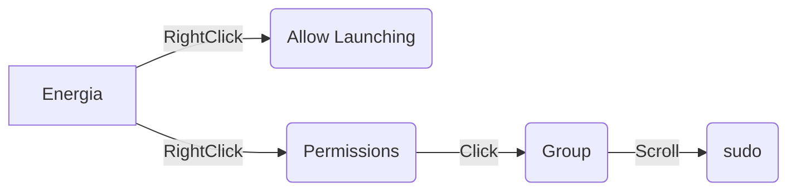

# 1. Installing Virtualbox
Source Page: [virtualbox Source](https://www.virtualbox.org/wiki/Downloads) 
#### 1.1 Download virtualbox here: [virtualbox](https://download.virtualbox.org/virtualbox/6.0.24/VirtualBox-6.0.24-139119-Win.exe)
#### 1.2 Download virtualbox extension here: [extension](https://download.virtualbox.org/virtualbox/6.0.24/Oracle_VM_VirtualBox_Extension_Pack-6.0.24.vbox-extpack)
#### 1.3 Create a Virtual Enviroment
New 
Name whatever
Type linux
version ubuntu 64
next
select memory Depends on system (1/2)
next
Create a virtual hard disk now
VDI (VirtualBox Disk Image)
Next
Dynamically Allocated
next
20GB
create
right click
setting 
usb
add 
one that says TI
made share bidirectional 
Start!
scroll to ubuntu-20.04.03-desktop-amd64.iso
start


# 2. Installing Energia on Linux
Source Page: [Energia](https://energia.nu/guide/install/linux/)
#### 2.1 Download Energia Lnux 64-bit: [Download](https://energia.nu/downloads/downloadv4.php?file=energia-1.8.10E23-linux64.tar.xz)
Download and Save File
#### 2.2 Extract
Open a terminal
> :bulb: **Terminal Shortcut:** Press *ctrl + alt + t*

Now we copy the compressed download to ***/Documents*** 
```python
cp /home/test/Downloads/energia-1.8.10E23-linux64.tar.xz /home/test/Documents 
```
Navigate to and extract the file
```python
cd Documents/
tar  -xvf  energia-1.8.10E23-linux64.tar.xz
```
*If energia package has been updated/different name use:  
```python
tar  -xvf  <tar_archive>
```
#### 2.3 Install IDE
Move to working directory, install arduino base and energia
```python
cd energia-1.8.10E23/
./arduino-linux-setup.sh $USER
sudo bash install.sh

```
Reboot the system
```python
systemctl reboot -i
```
After reboot navigate back to dierectory and open energia in administrator mode
```python
cd /Documents/energia-1.8.10E23/
sudo ./energia
```
Energia should now be open
Try blink sketch
#### 2.4 Configure Energia for our board mspblkjsdf
tools --> manage libraries
instlal Energia-RSLK-Library
##### 2.4.1 Install board 
Tools->Board->Board Manager->type '432' and install Energia MSP432 EMT RED boards(takes a while) &rarr; close
setup usb
Top screen->Devices->Insert Guest->Run 
plug in board
Top screen->Devices->USB->TI one
close energia (needs to restart to recognize usb)
sudo ./energia
Tools->board->select RED LaunchPad w/msp432p401rEMT(48MHz)
Tools->Port->/dev/ttyACM1
sudo apt install python-is-python3
ensure its right
command python --version
File->Example->0.1.Basics->Blink->upload

# 3. Installing ROS
Source Page: [ros wiki](http://wiki.ros.org/noetic/Installation/Ubuntu)

#### 3.1 Setup your sources.list
Setup your computer to accept software from packages.ros.org.
```python
-   sudo sh -c 'echo "deb http://packages.ros.org/ros/ubuntu $(lsb_release -sc) main" > /etc/apt/sources.list.d/ros-latest.list'
```
#### 3.2 Setup your keys
```python
sudo apt install curl
curl -s https://raw.githubusercontent.com/ros/rosdistro/master/ros.asc | sudo apt-key add -
```
#### 3.3 Make sure your package is up to date
```python
sudo apt update
sudo apt upgrade
```
#### 3.4 ROS Desktop-Full Install
```python
sudo apt install ros-noetic-desktop-full
```
#### 3.5 Enviroment Setup
```python
echo "source /opt/ros/noetic/setup.bash" >> ~/.bashrc
source ~/.bashrc
```
#### 3.6 Inspect ROS Enviroment 
```python
printenv | grep ROS
```
#### 3.7 Create a ROS Workspace
```python
mkdir -p ~/catkin_ws/src
cd ~/catkin_ws/
catkin_make
```

#### 3.8 Enviroment Source Upadate
```python
echo "source devel/setup.bash" >> ~/.bashrc
source ~/.bashrc
```
To make sure your workspace is properly overlayed by the setup script, make sure ROS_PACKAGE_PATH environment variable includes the directory you're in.
Ex: 
>/home/youruser/catkin_ws/src:/opt/ros/kinetic/share
```python
echo $ROS_PACKAGE_PATH
```


# 4. Installing ROSSerial
Source Page: [rosserial wiki](http://wiki.ros.org/rosserial_tivac/Tutorials/Energia%20Setup)
#### 4.1  Download and build rosserial_tivac
Navigate to your ROS workspace. Clone the git repository. Then build and install the package.
```python
cd <workspace_dir>/src
git clone https://github.com/ros-drivers/rosserial.git
cd <workspace_dir>
catkin_make
catkin_make install
```
#### 4.2  Prepare rosserial libraries for Energia
Now you have to prepare the libraries required for Energia to compile sketches with ROS enabled communication.
Add the installed rosserial_tivac to path. Or add the command to .bashrc.
```python
source <workspace_dir>/install/setup.bash
```
Navigate to your Energia sketches directory and prepare the libraries.
```python
cd <sketches_dir>
cd libraries
rosrun rosserial_tivac make_libraries_energia
```


```python

```
# 5. Custom Application Launcher
resource: https://linuxconfig.org/how-to-create-desktop-shortcut-launcher-on-ubuntu-22-04-jammy-jellyfish-linux
#### 5.1 Create File
Create the file on desktop
```python

#need to install vim
vim ~/Desktop/Energia.desktop
```
press 'i' to insert
copy and paste into doc
```python
#!/usr/bin/env xdg-open
[Desktop Entry]
Version=1.0
Type=Application
Terminal=false
Exec=/home/test/Documents/ros/energia-1.8.10E23-linux64/energia-1.8.10E23/energia
Name=Skype
Comment=Skype
Icon=/home/test/Documents/ros/energia-1.8.10E23-linux64/energia-1.8.10E23/lib/arduino.png
```
Then close and save with the following
>ESC :wq ENTER

Allow launching enables file as application launcher/shortcut
Set permission to Sudo to enable USB access


```xml

```


<div style="width: 640px; height: 480px; margin: 10px; position: relative;"><iframe allowfullscreen frameborder="0" style="width:640px; height:480px" src="https://lucid.app/documents/embedded/aa4ef4ba-cb00-46ba-bd06-d4fccdb5b917" id="ZXElKCnOegZY"></iframe></div>
